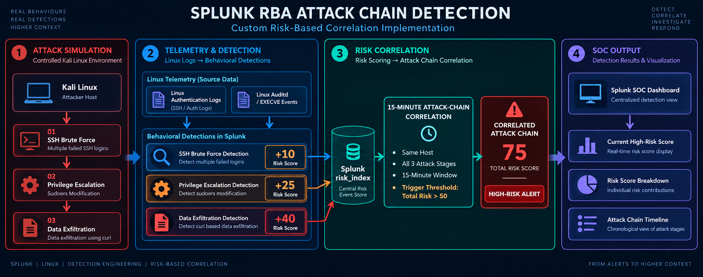
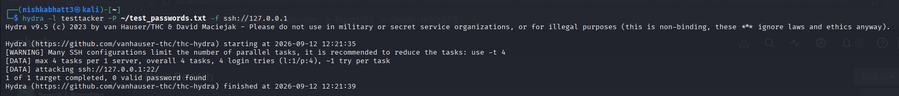
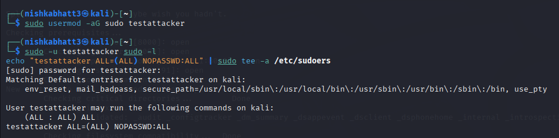
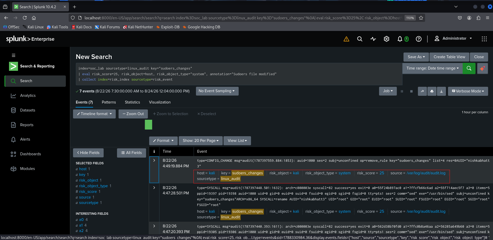
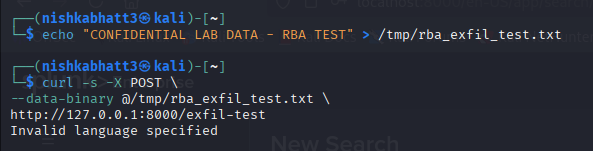
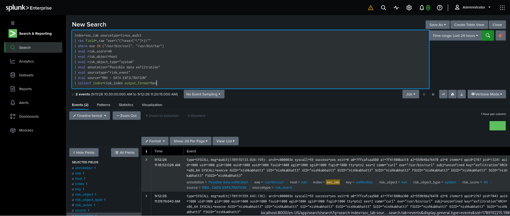
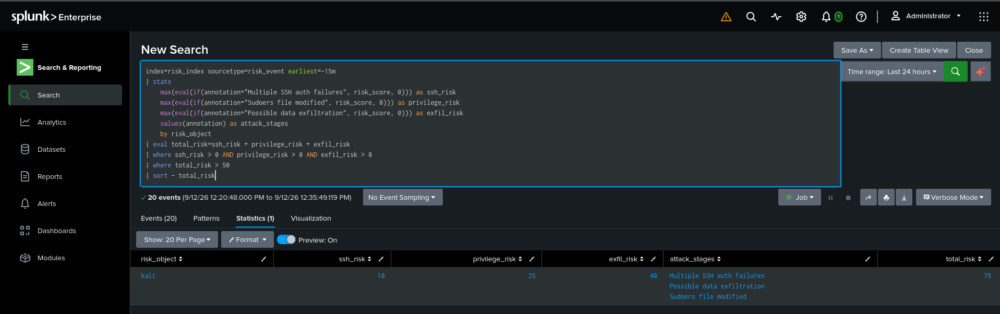
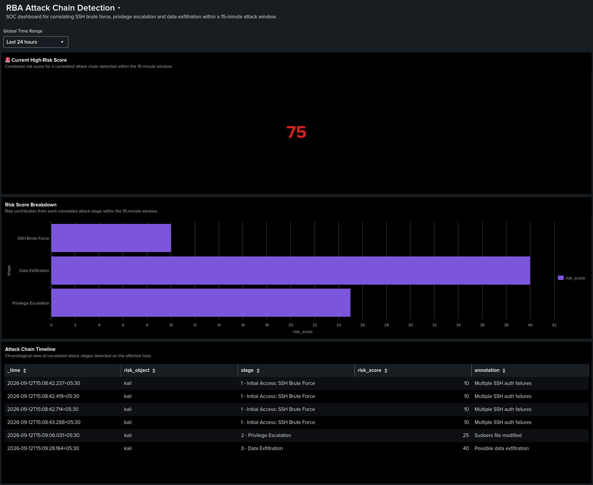

# Splunk RBA Attack Chain Detection

> A custom risk based attack chain detection implementation using **Splunk** and **behavior-based correlation** to identify SSH brute force, privilege escalation and data exfiltration occurring on the same host within a defined time window.

---

## Overview

This project demonstrates a **Risk-Based Alerting (RBA)-style detection approach** in Splunk for identifying multi-stage attack behavior.

Instead of generating independent alerts for each suspicious activity, individual behaviors are assigned risk scores and correlated based on the **same host** and a **15-minute rolling window**.

The simulated attack chain consists of:

1. **SSH Brute Force** → 10 risk
2. **Privilege Escalation** → 25 risk
3. **Data Exfiltration** → 40 risk

When all three behaviors occur on the same host within 15 minutes, the combined risk reaches **75**, exceeding the configured threshold of **50** and generating a high-risk alert.

---

## Key Features

- Custom Splunk risk scoring implementation
- Linux Auditd telemetry collection
- SSH brute-force detection
- Privilege escalation detection through sudoers modification
- Data exfiltration detection using `curl` execution
- Risk events stored in a dedicated `risk_index`
- Same host behavioral correlation
- 15-minute rolling attack window
- Risk threshold based high-risk alerting
- Splunk Dashboard Studio- SOC dashboard
- Controlled attack simulation in Kali Linux

---

## Architecture

The detection pipeline follows:

**Attack Simulation → Linux Telemetry → Splunk Detection → Risk Scoring → Risk Index → Attack Chain Correlation → High-Risk Alert → SOC Dashboard**

---

## Detection Workflow

### 1. SSH Brute Force

A controlled SSH brute-force simulation is performed against a local test account using Hydra.

Failed SSH authentication events are collected from Linux secure logs and assigned a risk score of **10**.

#### Detection Result

---

### 2. Privilege Escalation

A controlled privilege escalation scenario is simulated by modifying `/etc/sudoers`.

Linux Auditd monitors changes to the sudoers file and generates telemetry for the detection.

The behavior is assigned a risk score of **25**.

#### Detection Result

---

### 3. Data Exfiltration

A controlled exfiltration simulation uses `curl` to send test data to a local endpoint.

Auditd is configured to monitor execution of `/usr/bin/curl`, providing `EXECVE` telemetry for detection.

The behavior is assigned a risk score of **40**.

#### Detection Result

---

### Risk Calculation

| Attack Stage | Risk Score |
|--------------|-----------:|
| SSH Brute Force | 10 |
| Privilege Escalation | 25 |
| Data Exfiltration | 40 |
| **Total Risk** | **75** |

The final correlation successfully identified the complete attack chain on the same host with a total risk score of **75**.

---

## SOC Dashboard

A Splunk Dashboard Studio dashboard provides a visual SOC view of the correlated attack chain.

The dashboard includes:

- Current High-Risk Score
- Risk Score Breakdown
- Attack Chain Timeline

The demonstrated attack chain produced a **75 risk score**, exceeding the configured threshold of **50**.

---

## Future Improvements

- Expand the attack chain with additional MITRE ATT&CK techniques
- Add more behavioral risk signals
- Introduce dynamic risk scoring based on event frequency and context
- Integrate external threat intelligence
- Add automated response actions
- Implement additional correlation rules for lateral movement and persistence
- Extend the dashboard with longer-term risk trends

---

## Disclaimer

This project was developed and tested in a **controlled Kali Linux lab environment** for cybersecurity detection-engineering and educational purposes.

The attack simulations are intentionally limited to local test systems and should not be performed against systems without authorization.
